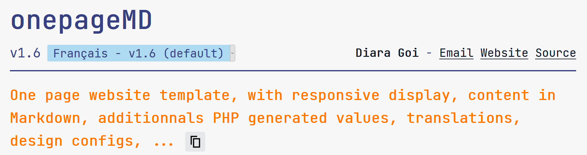

## Goals
### As the website creator
- Be able **to create a one page website quickly** in a new repository with the `Use this template` button.
- Write the general content inside Markdown files, including links and images. Markdown files can be local or remote, with automatic update activatable).
- Customizing of special values displayed at positions not usual in Markdown, with a config JSON file.
- Interpolate PHP generated values and generate them (to keep some information up-to-date). Generated values can be HTML, so it's possible to generate some part of the page in full HTML with Tailwindcss usable!
- Write translations of the content in other files.
- Customizing the page appearance is important too: possibility to choose a stylesheet or write a new one, change content width, change font family and font sizes, import new fonts, ...
- Insert automatic table of contents generated in PHP.
- Export the dynamic website to a static site (that runs without PHP).

### As a visitor
- Be able to choose a language in the browser and save it (language stored in a cookie).
- Visit the website in different devices (responsive display is a must).
- Short time of page loading (the app should be light and fast).
- Use the table of content to read only the wanted information.

## Setup preview
At the start (only once):
1. [Create a new repos based on the repos template](https://github.com/KanFF/onepageMD/generate) (link only work when logged)
1. Clone the repos
1. Copy paste the `config.json` file to `localconfig.json`.
1. Write your first contents in markdown files: files are named like `content-en.md` (`en` is the language id, here it's english).
1. Start edit and fill the `localconfig.json` file. All the [configurations available are documented.](/CONFIGURATION.md). Choose app name, layout configs, content information (with content files path for each language), user settings, ...

### Advanced configurations:
1. Setup github webhooks to activate auto update of your markdown files (with a secret in the config file).

### Preview of steps for content production
When the content is already created and translated, and that the content must be updated...
1. Update the content of the default language file and update its version in the cartouche.
1. You can already submit it if it's okay for you to have a content not entirely translated for a while. (Submit = git push if web hooks enabled, or upload the files on your server. The versions of each text (each translation) is displayed and the latest version number too (to know if the current content displayed in another language is up-to-date or not.
1. Update the translations in other languages and submit them.
1. The content are now published and you're done.
