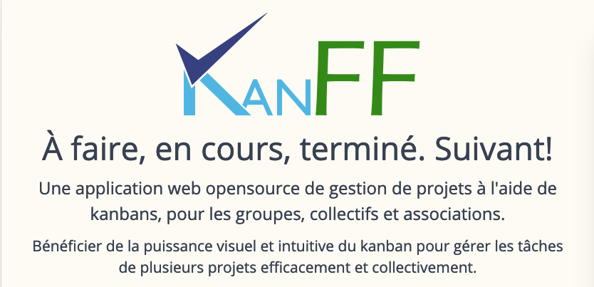

# kanff.org

The content of [kanff.org](https://kanff.org) main page. Currently, it's a one page website based [on onepageMD template](https://github.com/KanFF/onepageMD).

All modified files are in the `content` folder and the `config.json` file...

Code is not very clean for the while. FOSS licence will come soon...

## Static Build
- Simply launch `npm run build`
- Get the static website in the `dist` folder

## Todos
1. Translate in English
2. Add social networks
3. Manage newsletter system to have french response to confirmation emails and to avoid spam registration and sending in spam box
4. Create releases with release notes for previous tags
5. Add a FOSS licence
6. Write an article about this page creation
7. 
